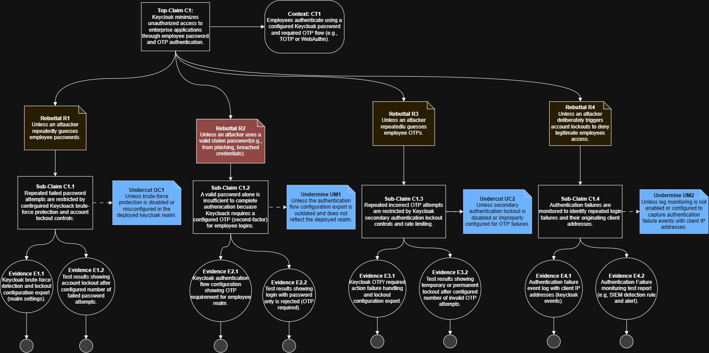
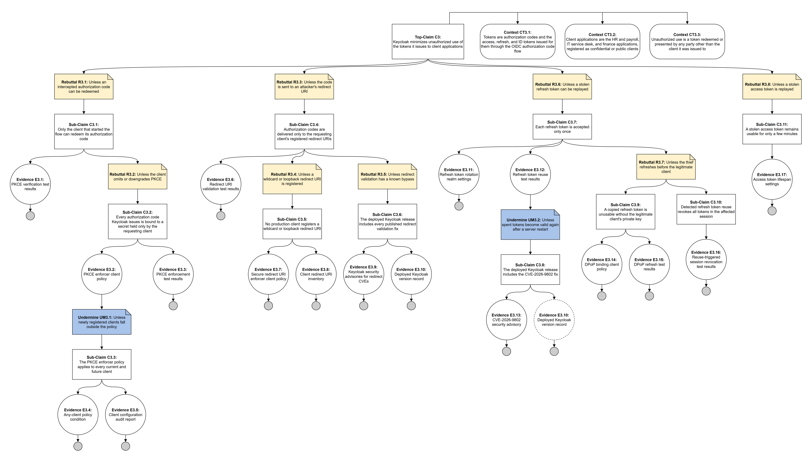
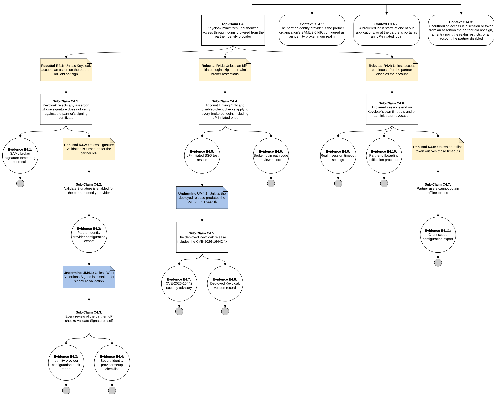
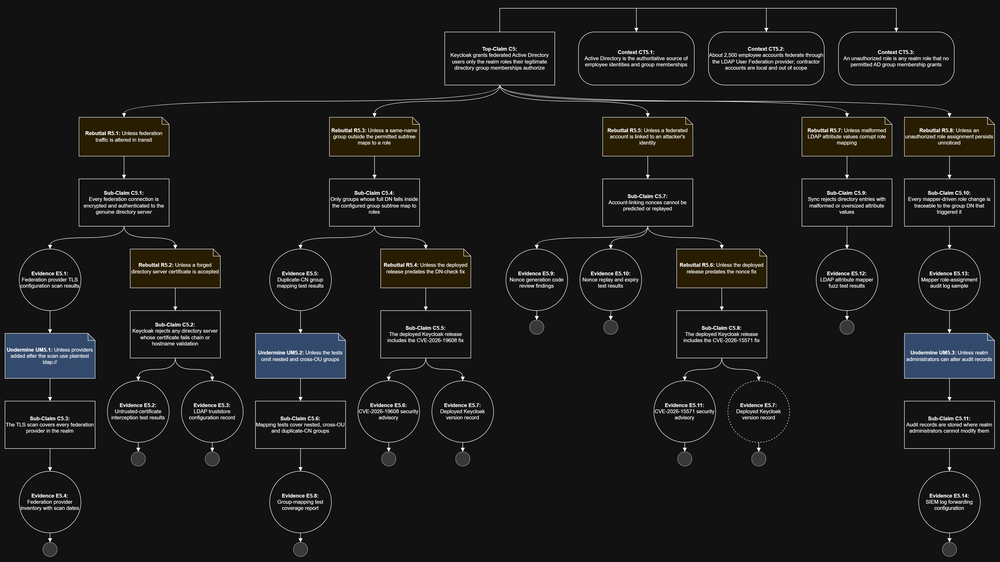

# Assurance Cases for Software Security Engineering — Team 3 (Keycloak)

<!--
TEAM NOTE (doesn't render on GitHub, only visible while editing):
- This file is the deliverable, so only put in what the grader should read.
- Owners, status and checklists live in the issues/project board (milestone "Assignment - Assurance Cases for Software Security Engineering").
- Notation, wording rules and file naming are in diagrams/README.md.
-->

## Part 1 — Assurance Cases

### Top-level claims

1. 
2. 
3. Keycloak minimizes unauthorized use of the tokens it issues to client applications.
4. Keycloak minimizes unauthorized access through logins brokered from the partner identity provider.
5. Keycloak grants federated Active Directory users only the realm roles their legitimate directory group memberships authorize. 

---

### Claim 1: `<top-level claim>` — [@Sewhenu-Ayeni](https://github.com/Sewhenu-Ayeni)



### Claim 2: `<top-level claim>` — [@AyRidd03](https://github.com/AyRidd03)


### Claim 3: Keycloak minimizes unauthorized use of the tokens it issues to client applications

The argument follows the attack chain from Interaction 3. Each rebuttal is a way someone other than the issuing client could use a token, and each sub-claim removes that doubt. The four branches cover the authorization code (R3.1), where it is delivered (R3.3), the refresh token (R3.6), and the access token (R3.8). Under R3.7, C3.9 and C3.10 are alternatives, and either one removes the doubt. Keycloak supports only C3.9 today, so C3.10 is shown as a gap (E3.16).



*Source: [`diagrams/assurance-case-claim-3.drawio`](diagrams/assurance-case-claim-3.drawio). Grey circles mark where a branch ends in evidence. The dashed E3.10 is the same evidence that supports C3.6, repeated under C3.8 to keep the diagram readable.*

### Claim 4: Keycloak minimizes unauthorized access through logins brokered from the partner identity provider

The argument follows the misuse chain from [Interaction 4](Requirements-for-Software-Security-Engineering.md#interaction-4-identity-brokering---external-identity-provider). Each rebuttal is a way someone could get in through the partner IdP without the partner actually vouching for them, and each sub-claim removes that doubt. The three branches cover forged assertions (R4.1), IdP-initiated logins (R4.3), and access after the partner disables an account (R4.4). Account linking and role mapping (iterations 2 and 3 of Interaction 4) overlap Claim 5 and are left out here.



*Source: [`diagrams/assurance-case-claim-4.drawio`](diagrams/assurance-case-claim-4.drawio). Grey circles mark where a branch ends in evidence.*

### Claim 5: Keycloak grants federated Active Directory users only the realm roles their legitimate directory group memberships authorize — [@isaiahjames11](https://github.com/isaiahjames11)

The argument follows the trust boundary from the Part 1 interaction: the federation link through which every employee identity and group membership enters Keycloak from Active Directory. Each rebuttal is a way a federated user could end up holding a realm role that no permitted AD group grants, and each sub-claim removes that doubt. The five branches cover the federation channel (R5.1), the group-to-role mapping (R5.3), the account-linking flow (R5.5), malformed directory data (R5.7), and detection of an unauthorized assignment (R5.8). Context CT5.1 sets the boundary of the claim: a change made by a legitimate AD administrator is authorized from Keycloak's point of view, so insider misuse of AD itself is out of scope. Two branches have no supporting feature in Keycloak today and are shown as gaps: attribute value limits (E5.12) and per-mapping audit events (E5.13).



*Source: [`diagrams/AssuranceClaim5.drawio`](diagrams/AssuranceClaim5.drawio). Grey circles mark where a branch ends in evidence.*
---

### AI-assisted improvement

**Prompt used:**

```text

```

**Reflection on usefulness:**

---

## Part 2 — Evidence Alignment Observations

<!-- For each evidence node in your diagram: Available / Can be made available / Requires additional effort. Link the Keycloak doc or code where it exists. -->

### Claim 1

| ID | Evidence | Alignment | Source / where it would come from | Gap |
|---|---|---|---|---|
| E1.1 | | | | |

### Claim 2

| ID | Evidence | Alignment | Source / where it would come from | Gap |
|---|---|---|---|---|
| E2.1 | | | | |

### Claim 3

| ID | Evidence | Alignment | Source / where it would come from | Gap |
|---|---|---|---|---|
| E3.1 | PKCE verification test results | Available | Keycloak's [`OAuthProofKeyForCodeExchangeTest`][c3-pkce-test] covers matching, mismatched, missing, and malformed verifiers for both `S256` and `plain`. | None for Keycloak itself. |
| E3.2 | PKCE enforcer client policy | Can be made available | The [`pkce-enforcer`][c3-pkce-exec] client-policy executor, or the per-client "Require PKCE" switch added in 26.6 ([PR #44365][c3-pr44365]). | Not configured by default; "there are no client policies configured by default" ([client policies docs][c3-cp-docs]). Our realm export would need to show it. |
| E3.3 | PKCE enforcement test results | Available | The `*PkceEnforced` cases in [`OAuthProofKeyForCodeExchangeTest`][c3-pkce-test] (missing challenge, missing method, method mismatch). | Shows the feature works, not that our clients have it turned on. E3.2 closes that gap. |
| E3.4 | Any-client policy condition | Can be made available | The [`any-client`][c3-any-client] client-policy condition. | Our policy would have to use it instead of a narrower condition such as client type, or new clients could slip past (UM3.1). |
| E3.5 | Client configuration audit report | Requires additional effort | Nothing in Keycloak produces one. It would be scripted from the Admin REST API or a realm export and run on a schedule. | Needs to be built and owned by someone. This is the largest process gap. |
| E3.6 | Redirect URI validation test results | Available | [`OAuthRedirectUriTest`][c3-redirect-test] (`testWildcard`, `testLocalhost`, `testLoopback`). | The tests confirm that a registered wildcard is honored as a prefix match, which is exactly the behavior R3.4 doubts. |
| E3.7 | Secure redirect URI enforcer client policy | Can be made available | The [`secure-redirect-uris-enforcer`][c3-sru-exec] executor (Keycloak 24+), tested in [`ClientPoliciesExecutorTest`][c3-cp-exec-test]. | Off by default. |
| E3.8 | Client redirect URI inventory | Can be made available | Each client's `redirectUris` from the Admin REST API or a realm export. | Must be regenerated whenever a client changes. |
| E3.9 | Keycloak security advisories for redirect CVEs | Available | [CVE-2023-6927][c3-cve-6927], [CVE-2024-1132][c3-cve-1132], [CVE-2024-8883][c3-cve-8883]. | None. |
| E3.10 | Deployed Keycloak version record | Can be made available | The admin console's *Server info* page. | Our deployment is hypothetical; the record is only useful if a patch process keeps it current. |
| E3.11 | Refresh token rotation realm settings | Can be made available | *Revoke Refresh Token* on, with *Refresh Token Max Reuse* set to 0. | Off by default and realm-wide only; a per-client setting is still a proposal ([PR #51798][c3-pr51798]). |
| E3.12 | Refresh token reuse test results | Available | [`RefreshTokenRevokeTest`][c3-rt-test] (`refreshTokenReuseTokenWithRefreshTokensRevoked`, `refreshTokenSameSecondReplayRejected`, and the concurrent-request cases). | Runs against a single test server and does not cover a restart with persistent sessions (UM3.2). |
| E3.13 | CVE-2026-9802 security advisory | Available | [CVE-2026-9802][c3-cve-9802] ([Keycloak issue #49426][c3-issue49426]). | None. |
| E3.14 | DPoP binding client policy | Can be made available | The *Require DPoP bound tokens* client setting or the [`dpop-bind-enforcer`][c3-dpop-exec] executor ([Keycloak 26.4+][c3-dpop-blog]). | Off by default. Each public client must also send DPoP proofs, which may require changes to our applications. |
| E3.15 | DPoP refresh test results | Available | [`DPoPTest`][c3-dpop-test] (`testDPoPByPublicClientTokenRefreshWithoutDPoPProof`, `testBindOnlyRefreshTokenDPoPEnforcerExecutor`, `testTokenRefreshWithReplayedDPoPProofByPublicClient`). | None for Keycloak itself. |
| E3.16 | Reuse-triggered session revocation test results | Requires additional effort | No implementation was located in [`TokenManager`][c3-tokenmanager] or [`RefreshTokenGrantType`][c3-rtgrant] (SR-3.6). Producing this evidence would require a Keycloak change or an upstream feature request. | The largest technical gap: C3.10 has no support today. |
| E3.17 | Access token lifespan settings | Available | The realm *Access Token Lifespan* and each client's override. | A client override can lengthen the lifespan, so E3.5 would also need to check overrides. |

*Claim 3 gaps.* Keycloak's own tests already cover each existing mechanism this argument relies on, so evidence about Keycloak's *behavior* is largely available. The gaps are in evidence about *our configuration*: five items (E3.2, E3.4, E3.7, E3.11, E3.14) depend on settings that are off by default and would have to be exported from our realm, and nothing in Keycloak produces the audit report (E3.5) that would show those settings stay in place. The one gap Keycloak itself cannot close today is E3.16: without revoking the session on detected reuse, C3.10 is unsupported, and R3.7 rests entirely on C3.9 (DPoP for public clients).

[c3-pkce-test]: https://github.com/keycloak/keycloak/blob/main/testsuite/integration-arquillian/tests/base/src/test/java/org/keycloak/testsuite/oauth/OAuthProofKeyForCodeExchangeTest.java
[c3-pkce-exec]: https://github.com/keycloak/keycloak/blob/main/services/src/main/java/org/keycloak/services/clientpolicy/executor/PKCEEnforcerExecutor.java
[c3-pr44365]: https://github.com/keycloak/keycloak/pull/44365
[c3-cp-docs]: https://github.com/keycloak/keycloak/blob/main/docs/documentation/server_admin/topics/clients/client-policies.adoc
[c3-any-client]: https://github.com/keycloak/keycloak/blob/main/services/src/main/java/org/keycloak/services/clientpolicy/condition/AnyClientConditionFactory.java
[c3-redirect-test]: https://github.com/keycloak/keycloak/blob/main/testsuite/integration-arquillian/tests/base/src/test/java/org/keycloak/testsuite/oauth/OAuthRedirectUriTest.java
[c3-sru-exec]: https://github.com/keycloak/keycloak/blob/main/services/src/main/java/org/keycloak/services/clientpolicy/executor/SecureRedirectUrisEnforcerExecutor.java
[c3-cp-exec-test]: https://github.com/keycloak/keycloak/blob/main/testsuite/integration-arquillian/tests/base/src/test/java/org/keycloak/testsuite/client/policies/ClientPoliciesExecutorTest.java
[c3-cve-6927]: https://www.cve.org/CVERecord?id=CVE-2023-6927
[c3-cve-1132]: https://www.cve.org/CVERecord?id=CVE-2024-1132
[c3-cve-8883]: https://www.cve.org/CVERecord?id=CVE-2024-8883
[c3-pr51798]: https://github.com/keycloak/keycloak/pull/51798
[c3-rt-test]: https://github.com/keycloak/keycloak/blob/main/tests/base/src/test/java/org/keycloak/tests/oauth/RefreshTokenRevokeTest.java
[c3-cve-9802]: https://www.cve.org/CVERecord?id=CVE-2026-9802
[c3-issue49426]: https://github.com/keycloak/keycloak/issues/49426
[c3-dpop-exec]: https://github.com/keycloak/keycloak/blob/main/services/src/main/java/org/keycloak/services/clientpolicy/executor/DPoPBindEnforcerExecutorFactory.java
[c3-dpop-blog]: https://www.keycloak.org/2025/10/dpop-support-26-4
[c3-dpop-test]: https://github.com/keycloak/keycloak/blob/main/tests/base/src/test/java/org/keycloak/tests/oauth/DPoPTest.java
[c3-tokenmanager]: https://github.com/keycloak/keycloak/blob/main/services/src/main/java/org/keycloak/protocol/oidc/TokenManager.java
[c3-rtgrant]: https://github.com/keycloak/keycloak/blob/main/services/src/main/java/org/keycloak/protocol/oidc/grants/RefreshTokenGrantType.java

### Claim 4

| ID | Evidence | Alignment | Source / where it would come from | Gap |
|---|---|---|---|---|
| E4.1 | SAML broker signature tampering test results | Available | The `testSignatureTampering_*` cases in [`KcSamlSignedBrokerTest`][c4-signed-test] cover all eight combinations of signed document, signed assertion, and encrypted assertion. | They run with Validate Signature on, so they show the feature works, not that our provider has it on. E4.2 closes that gap. |
| E4.2 | Partner identity provider configuration export | Can be made available | The partner provider's `validateSignature`, `wantAssertionsSigned`, and signing certificate from the Admin REST API or a realm export. | A snapshot of one moment, and easy to misread (UM4.1). |
| E4.3 | Identity provider configuration audit report | Requires additional effort | Nothing in Keycloak produces one. It would be scripted from the Admin REST API and run on a schedule. | Needs to be built and owned by someone, the same gap as E3.5. |
| E4.4 | Secure identity provider setup checklist | Requires additional effort | Our [SSE documentation review][c4-sse-review] proposed one: Validate Signature on, Identity Provider Entity ID set, mappers reviewed. | Keycloak's [SAML identity provider docs][c4-idp-docs] have no such checklist and never say that Want Assertions Signed only checks that a signature is present ([`SAMLEndpoint`][c4-saml-endpoint]). |
| E4.5 | IdP-initiated SSO test results | Available | [`KcSamlIdPInitiatedSsoTest`][c4-idp-test] (`testLinkOnlyBrokerIdpInitiated`, `testDisabledClient`, `testDisabledBroker`). | The tests cover current code, not the release we run (UM4.2). |
| E4.6 | Broker login path code review record | Available | Our SSE review of [`IdentityBrokerService`][c4-broker-svc] for SR-4.4, which found the Account Linking Only and disabled-client checks on every brokered login. | Tied to one commit, so it has to be repeated after upgrades. |
| E4.7 | CVE-2026-16442 security advisory | Available | [CVE-2026-16442][c4-cve-16442]: the IdP-initiated SSO endpoint did not check whether a provider was restricted to account linking. | None. |
| E4.8 | Deployed Keycloak version record | Can be made available | The admin console's *Server info* page. | Same as E3.10: only useful if a patch process keeps it current. |
| E4.9 | Realm session timeout settings | Available | The realm's *SSO Session Idle* (30 minutes by default) and *SSO Session Max* (10 hours by default) ([defaults][c4-timeouts]). | They do not apply to offline tokens (R4.5). |
| E4.10 | Partner offboarding notification procedure | Requires additional effort | An agreement that the partner tells us when a contractor leaves, followed by an admin sign-out in Keycloak. | Keycloak is never told when the partner disables an account, and nothing inside Keycloak can close this gap. |
| E4.11 | Client scope configuration export | Can be made available | Each partner-facing client's optional client scopes, from the Admin REST API or a realm export. | Opt-out, not opt-in: `offline_access` is added to clients as an optional client scope by default, and an offline token stays valid after logout ([offline access docs][c4-offline-docs]). |

*Claim 4 gaps.* Keycloak's own tests cover both mechanisms this argument relies on (E4.1, E4.5), so evidence about Keycloak's *behavior* is available. CVE-2026-16442 shows the IdP-initiated check behind C4.4 was missing in earlier releases, which is why UM4.2 asks for a version record. As in Claim 3, the gaps are in evidence about *our configuration*: Validate Signature has to be on and stay on (E4.2 to E4.4), and offline access has to be removed for partner-facing clients (E4.11). The one gap Keycloak cannot close at all is E4.10: it is never told when the partner disables an account, so cutting off a contractor before the session times out depends on a procedure with the partner.

[c4-signed-test]: https://github.com/keycloak/keycloak/blob/main/testsuite/integration-arquillian/tests/base/src/test/java/org/keycloak/testsuite/broker/KcSamlSignedBrokerTest.java
[c4-idp-test]: https://github.com/keycloak/keycloak/blob/main/testsuite/integration-arquillian/tests/base/src/test/java/org/keycloak/testsuite/broker/KcSamlIdPInitiatedSsoTest.java
[c4-saml-endpoint]: https://github.com/keycloak/keycloak/blob/6688a3d63f59e0c4a9131bfdd556c4312799f04e/services/src/main/java/org/keycloak/broker/saml/SAMLEndpoint.java#L604-L614
[c4-broker-svc]: https://github.com/keycloak/keycloak/blob/6688a3d63f59e0c4a9131bfdd556c4312799f04e/services/src/main/java/org/keycloak/services/resources/IdentityBrokerService.java#L723-L770
[c4-sse-review]: Requirements-for-Software-Security-Engineering.md#part-2--oss-documentation-review
[c4-idp-docs]: https://github.com/keycloak/keycloak/blob/main/docs/documentation/server_admin/topics/identity-broker/saml.adoc
[c4-cve-16442]: https://www.cve.org/CVERecord?id=CVE-2026-16442
[c4-timeouts]: https://github.com/keycloak/keycloak/blob/6688a3d63f59e0c4a9131bfdd556c4312799f04e/server-spi-private/src/main/java/org/keycloak/models/Constants.java#L64-L72
[c4-offline-docs]: https://github.com/keycloak/keycloak/blob/main/docs/documentation/server_admin/topics/sessions/offline.adoc

### Claim 5

| ID | Evidence | Alignment | Source / where it would come from | Gap |
|---|---|---|---|---|
| E5.1 | Federation provider TLS configuration scan results | Can be made available | Each provider's Connection URL (ldap:// vs ldaps://) and startTls setting, readable from the Admin REST API or a realm export | Keycloak accepts plaintext ldap:// with StartTLS off; nothing in the realm prevents it. The scan has to be written and run by us. |

### Summary of gaps

---

## Project Board

[Assurance Cases Milestones](https://github.com/JBoogieman/SoftwareAssuranceTeam3/milestone/3)

## Team Reflection

<!-- Compiled from individual reflections in the issue: What did you learn? What did you find most useful? -->
