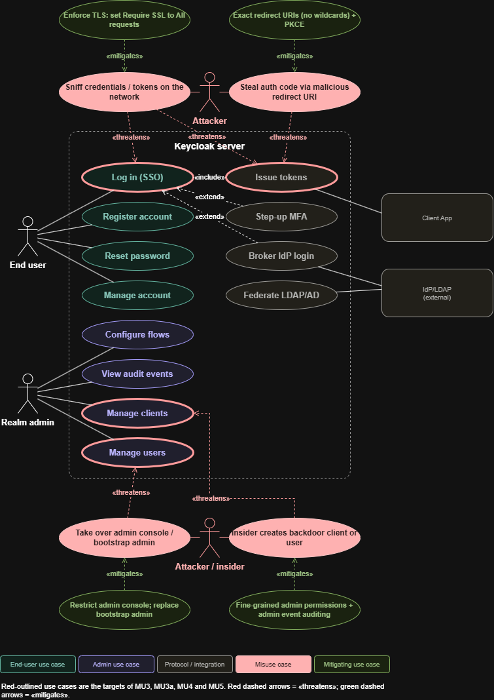
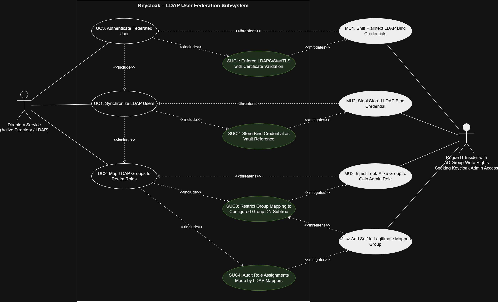

# Requirements for Software Security Engineering — Team 3 (Keycloak)

### Interaction 1: End-User Authentication (Browser Login + OTP)

**Interaction description:**  
An employee uses Keycloak through a web browser to authenticate with a password and one-time password (OTP) before accessing an enterprise application. This interaction is essential because Keycloak provides the authentication service between the employee and the protected enterprise application.

**Use/misuse case diagram:**  

**Misuser profile:**  
**Misuser:** Credential-stuffing attacker using breached credentials

- **Motive:** Gain unauthorized access to an employee's account and enterprise application.
- **Resources:** Lists of previously breached usernames/passwords and automated login tools.
- **Attack of choice:** Credential stuffing through repeated browser login attempts.
- **Available access:** External access to the Keycloak login page, with no legitimate employee account or administrative access.

**Iteration narrative:**  
**Iteration 1 – Credential Stuffing:** A credential-stuffing attacker may use breached username and password combinations to repeatedly attempt authentication through the Keycloak login page. The misuse case **Submit Reused or Stolen Credentials** threatens **Password Authentication**. **Brute-Force Protection** mitigates repeated failed authentication attempts by tracking failures and applying configured lockout protections.

**Iteration 2 – Correct Stolen Password:** If the attacker possesses a correct stolen password, brute-force protection alone may not prevent unauthorized authentication because the password itself is valid. The misuse case **Use Correct Stolen Password** threatens **Authenticate to Application**. **OTP Authentication** mitigates this misuse by requiring an additional authentication factor when OTP is configured as required.

**Iteration 3 – Repeated OTP Guessing:** After obtaining a correct password, an attacker may repeatedly attempt to guess the employee's OTP. The misuse case **Repeatedly Guess OTP** threatens **OTP Authentication**. **Secondary Authentication Failures Lockout** mitigates repeated failures against the second authentication factor according to its configured threshold.

**Iteration 4 – Account Lockout Denial of Service:** An attacker may intentionally cause repeated authentication failures against known employee accounts so that account lockout protections deny legitimate users access. The misuse case **Abuse Account Lockout to Deny Access** threatens **Authenticate to Application**. **Login Failure Monitoring and IP Blocking** mitigates this misuse by using authentication-failure and client-address information to identify attack sources. Keycloak provides the failure information, while blocking an attacking IP may require an external intrusion-prevention or firewall mechanism.

**Derived security requirements:**

| ID | Requirement | Addresses misuse case | Implemented in Keycloak? (doc/code link) |
|---|---|---|---|
| SR-1.1 | Keycloak shall detect repeated failed password authentication attempts and temporarily or permanently disable further login attempts according to the configured brute-force protection settings. | Submit Reused or Stolen Credentials | **Yes.** Keycloak provides configurable brute-force detection, including temporary and permanent lockout. [Keycloak Server Administration Guide](https://www.keycloak.org/docs/latest/server_admin/#password-guess-brute-force-attacks) |
| SR-1.2 | Keycloak shall require a valid OTP as a second authentication factor when OTP is configured as required in the employee authentication flow. | Use Correct Stolen Password | **Yes.** Keycloak supports OTP as a second-factor authenticator in configurable authentication flows. [Keycloak Server Administration Guide](https://www.keycloak.org/docs/latest/server_admin/) |
| SR-1.3 | Keycloak shall track repeated failed OTP authentication attempts and apply a secondary authentication failure lockout according to the configured threshold. | Repeatedly Guess OTP | **Yes.** Keycloak provides Secondary Authentication Failures Lockout for failures against second-factor authenticators such as OTP. [Keycloak Server Administration Guide](https://www.keycloak.org/docs/latest/server_admin/#password-guess-brute-force-attacks) |
| SR-1.4 | Keycloak shall record authentication failures with information sufficient to support monitoring of repeated login failures and identification of the originating client address. | Abuse Account Lockout to Deny Access | **Partially.** Keycloak provides login-failure and client-IP information, but blocking attacking IP addresses relies on an external intrusion-prevention or firewall mechanism. [Keycloak Server Administration Guide](https://www.keycloak.org/docs/latest/server_admin/#password-guess-brute-force-attacks) |

**Alignment observations:**  
The misuse case analysis generally aligns with security capabilities available in Keycloak. Keycloak provides configurable brute-force detection, OTP-based second-factor authentication, and protection against repeated secondary authentication failures. However, some of these protections require administrator configuration and are not enabled by default. The account-lockout denial-of-service scenario also identifies a limitation in Keycloak's protection boundary: Keycloak can provide authentication-failure and client-IP information, but blocking the source of an attack may require an external intrusion-prevention or firewall mechanism.

---
# Interaction 2: Realm admin manages credentials and password policy

## Interaction description

The Realm admin sets or resets user credentials and configures the realm's password policy (length, composition, hashing, history, blacklist). Every account in the realm depends on this, so a mistake here weakens every login.

## Use/misuse case diagram

**Use cases (4):**

| ID | Use case | Diagram node |
|---|---|---|
| UC-1 | Set or reset user credentials | Manage users |
| UC-2 | Configure password policy and hashing | Configure flows |
| UC-3 | Validate credentials at login | Log in (SSO) |
| UC-4 | Review credential and admin events | View audit events |

**Misuse cases (4):**

| ID | Misuse case | Threatens |
|---|---|---|
| MU-1 | Take over the admin console and reset credentials or weaken the policy (existing MU3) | UC-1, UC-2 |
| MU-2 | Insider plants a known credential or lowers the policy (existing MU3a, extended to users) | UC-1, UC-2 |
| MU-3 | Credential stuffing or brute force exploiting a weak policy (new) | UC-3 |
| MU-4 | Offline cracking of dumped credential hashes (new) | UC-1, UC-2 |

## Misuser profile

| Misuser | Motive | Resources | Attack of choice | Access level |
|---|---|---|---|---|
| **Ransom Hacker** (MU-1) | Extortion through control of all identities | High: breach lists, Shodan, exploit tooling | Brute force or default credentials on an exposed `/admin` console or bootstrap admin | External and unauthenticated, escalating to super-admin |
| **Disgruntled Employee** (MU-2) | Retaliation and retained access after leaving | Medium: realm knowledge and Admin REST API scripting | Privilege abuse: sets a known "temporary" password, or disables lockout or policy rules | Authenticated `manage-users` admin, not super-admin |
| **Stuffing Hacker** (MU-3) | Resale of accounts and fraud | Medium: leaked password lists, botnet, proxy rotation | Credential stuffing and password spraying against the login endpoint | External and unauthenticated |
| **Exploit Hacker** (MU-4) | Reusing cracked passwords on other sites | Medium to high: GPU rig, hashcat, a database backup or SQL injection foothold | Offline dictionary attack on stolen credential hashes | Read-only access to the Keycloak database or backups |

## Iteration narrative

1. **MU-1 (Hacker).** Hacker reaches the exposed admin console, tries the bootstrap admin, and resets a privileged user's password. The countermeasure is to restrict the console to an internal network and replace the bootstrap admin with a named admin.
2. **MU-1 residual.** Hacker phishes a real admin and logs in with the stolen password. The countermeasure is mandatory MFA (WebAuthn) for admin roles, plus brute-force lockout.
3. **MU-2 (Disgruntled Employee).** With legitimate `manage-users` rights the Disgruntled Employee sets a known permanent password, or weakens the policy so she can pick a trivial one. The countermeasures are fine-grained admin permissions (no policy editing for user managers), forced "temporary" passwords, and admin event auditing.
4. **MU-2 residual.** The Disgruntled Employee tampers with the audit trail, or collaborates with a second admin. The countermeasures are shipping admin events to an external append-only log and requiring two-person approval for privileged changes.
5. **MU-3 (Hacker).** Users reuse leaked passwords, and a lax policy accepts them. The countermeasures are a password blacklist, minimum length, brute-force detection, and MFA.
6. **MU-4 (Hacker).** Hacker gets a database dump and cracks the hashes offline. The countermeasures are a memory-hard hash (Argon2) or high PBKDF2 iterations, database encryption and backup protection, and forcing a rehash and rotation after a suspected breach.
7. **MU-4 residual.** Weak passwords still fall to a dictionary attack. The countermeasure is to combine the blacklist and length policy with passkeys or WebAuthn, so there is no password to crack.

## Derived security requirements

| ID | Requirement | Addresses misuse case | Implemented in Keycloak? (doc/code link) |
|---|---|---|---|
| SR-2.1 | The admin console shall be reachable only from trusted networks. The bootstrap admin shall be removed after setup. | MU-1 | **Partial.** Keycloak 26 issues a temporary bootstrap admin, but network restriction is done at the reverse proxy or hostname config: [Admin console hostname](https://www.keycloak.org/server/hostname), [Reverse proxy](https://www.keycloak.org/server/reverseproxy) |
| SR-2.2 | All admin accounts shall require MFA (WebAuthn or OTP). | MU-1 | **Partial.** Achievable via authentication flows and a conditional role check, but not enforced by default: [Authentication flows](https://www.keycloak.org/docs/latest/server_admin/#_authentication-flows) |
| SR-2.3 | Admin-set passwords shall be temporary and force a change at first login. | MU-2 | **Yes.** The "Temporary" toggle plus the Update Password required action: [User credentials](https://www.keycloak.org/docs/latest/server_admin/#user-credentials) |
| SR-2.4 | Users who manage users shall not be able to edit realm policy, and vice versa (least privilege). | MU-2 | **Partial.** Fine-grained admin permissions exist, but the feature has been changing between versions: [Fine-grained admin permissions](https://www.keycloak.org/docs/latest/server_admin/#_fine_grain_permissions) |
| SR-2.5 | Admin events (credential resets, policy changes) shall be recorded and exported to an external append-only store. | MU-2 | **Partial.** Admin events are built in but off by default. External export needs an event listener or log shipping: [Auditing admin events](https://www.keycloak.org/docs/latest/server_admin/#auditing-and-events) |
| SR-2.6 | Two-person approval shall be required for privileged credential and policy changes. | MU-2 | **No.** There is no native workflow, so it needs an external process or IGA tool. |
| SR-2.7 | Password policy shall enforce a minimum length, a blacklist, and a not-recently-used rule. | MU-3 | **Yes.** Built-in policy types: [Password policies](https://www.keycloak.org/docs/latest/server_admin/#_password-policies); code under `services/src/main/java/org/keycloak/policy/` |
| SR-2.8 | Repeated failed logins shall trigger temporary or permanent lockout. | MU-3 | **Yes, opt-in.** Brute-force detection is disabled by default: [Brute force](https://www.keycloak.org/docs/latest/server_admin/#password-guess-brute-force-attacks) |
| SR-2.9 | Passwords shall be stored with a memory-hard or high-iteration hash, and a policy change shall force rehash. | MU-4 | **Partial.** Argon2 is the default for non-FIPS deployments in recent versions, and PBKDF2-SHA512 defaults to 210,000 iterations. Rehash happens only at the user's next login: [Password hashing](https://www.keycloak.org/docs/latest/server_admin/#_password-policies) |
| SR-2.10 | Phishing-resistant credentials (WebAuthn or passkeys) shall be available for all users. | MU-3, MU-4 | **Yes.** WebAuthn and passkey support: [WebAuthn](https://www.keycloak.org/docs/latest/server_admin/#_webauthn) |
| SR-2.11 | Alerts shall be raised when the password policy is weakened or a service account gains admin roles. | MU-2 | **No.** There is no built-in alerting, so it needs SIEM rules over admin events. |

## Alignment observations

- **Well covered:** Password composition, blacklist, history, expiry, hashing choice, temporary passwords, brute-force lockout, and WebAuthn are all native, and each one is directly traceable to a misuse case.
- **Off by default, so easy to miss:** Brute-force detection and admin event logging are disabled in a new realm. A deployment can therefore satisfy the feature list and still be exposed to MU-2 and MU-3. Hardening guidance should treat them as mandatory settings.
- **Policy is not retroactive:** The docs say a new password policy does not apply to existing users until they change their password, unless you use "Update password" or "Expire password". This partly defeats SR-2.9 and SR-2.7 after a breach, because old weak hashes and passwords persist until the next login.
- **Insider threat is the weak spot:** Keycloak has no two-person approval (SR-2.6) and no built-in alerting (SR-2.11), and fine-grained permissions are still evolving. MU-2's final residual risk is therefore only reducible with external tooling.
- **Admin MFA is configuration, not a guarantee:** SR-2.2 depends on the operator building the right flow. The bootstrap admin is safer in Keycloak 26 but still needs manual replacement.
---
### Interaction 3: Relying Client Application — Token Acquisition via the OIDC Authorization Code Flow 

#### Description

A registered client application, such as a confidential server-side web app or a public single-page or mobile app, sends the user's browser to Keycloak's authorization endpoint, receives a short-lived authorization code at its registered redirect URI, and exchanges that code at the token endpoint for ID, access, and refresh tokens. It later uses the refresh token to obtain new access tokens without sending the user back through login. In our environment, these clients are the HR and payroll, IT service desk, and finance applications described in our proposal, used by employees on managed workstations, remote employees, and contractors. Every protected resource in a Keycloak deployment is ultimately reached through tokens obtained this way, which makes this the highest-value interaction between Keycloak and the applications it protects. It sits inside the authorization and credential subsystem our team scoped for the design and code-analysis deliverables.

#### Use/misuse case diagram

#### Actors and misusers

| *Type* | *Name* | *Motive, resources, attack of choice, access* |
| ----- | ----- | ----- |
| Actor | *Relying Client Application* | Registered confidential or public client, such as our HR and payroll, IT service desk, or finance applications, that needs tokens to act on a user's behalf. |
| Actor | *End User (Resource Owner)* | An employee or contractor who authenticates in the browser and consents to the scopes the client requests. |
| Misuser | *Co-resident Code Interceptor* | A malicious app on the same device as a public client, such as a remote employee's personal phone that the organization does not manage. Needs no network position; registers the same URI scheme and captures the code as the OS routes the redirect. Wants tokens without ever learning the password. |
| Misuser | *Redirect-Manipulating Phisher* | External, no account, no insider access. Wants an employee's or contractor's authorization code, and through it their access to payroll or finance data, without needing the password. Sends victims an authorization link built from a legitimate `client_id` and an attacker-controlled `redirect_uri`. The phish is convincing because the login page really is Keycloak. |
| Misuser | *Refresh Token Scavenger* | Holds a refresh token lifted from browser storage (via XSS), a mobile backup, or a log. Wants durable access that survives a password change, and will race the legitimate client to use it. |

#### Iteration narrative

Each round introduces a countermeasure, then asks what defeats that countermeasure. Requirement IDs refer to the table below.

*Round 1, Code interception.* The base use case is *Authorization Code Grant*, and the misuse case *Intercept Authorization Code* threatens it: the Co-resident Code Interceptor captures the code as the OS delivers the redirect. For a public client with no secret, whoever presents the code receives the tokens, so neither TLS nor the user's correct login helps. → *PKCE Verification*: the client sends a SHA-256 hash of a one-time secret (`code_challenge`) with the authorization request and must present the secret itself (`code_verifier`) at the token endpoint, over a back channel the interceptor cannot observe. Keycloak enforces this whenever a challenge was sent (SR-3.1).

*Round 2, Defeating PKCE by avoiding it.* PKCE only protects flows that use it, and the misuse case *Omit / Downgrade PKCE Challenge* threatens *PKCE Verification* directly. A client that never sends a challenge, whether it is legacy, misconfigured, or not written for PKCE, receives codes bound to nothing, which reopens Round 1. A client that uses the `plain` method sends the verifier itself through the front channel, where the interceptor can read it. Keycloak already rejects a `code_verifier` presented when no challenge was sent, which is the downgrade described in RFC 9700 §4.8.2 (SR-3.3). For a client without a PKCE requirement, though, it has no basis to refuse an authorization request that simply omits the challenge. → *Require PKCE (S256) per Client*: a server-side policy that refuses any authorization request without an S256 challenge (SR-3.2). A control the attacker can opt out of is not a control.

*Round 3, Attacking the redirect instead.* In the misuse case *Manipulate Redirect URI*, which threatens *Authorization Code Grant*, the Redirect-Manipulating Phisher sends a victim an authorization link that pairs a legitimate `client_id` with the attacker's own `redirect_uri`. The victim signs in at the real Keycloak domain, sees a valid certificate, and the code is delivered to the attacker. For a public client, PKCE does not help here because the attacker started the flow and generated the verifier; only a confidential client's secret would stop the attacker from redeeming the code directly. What makes the attacker's URI acceptable is loose matching, such as a trailing wildcard or a localhost registration left in production. → *Exact Redirect URI Validation*, with wildcard registrations prohibited (SR-3.4).

*Round 4, Stealing what the flow produces.* With the code path hardened, the Refresh Token Scavenger targets the output of the flow. A refresh token is a long-lived bearer credential that mints new access tokens and can outlive the user's password change. The base use case is now *Refresh Access Token*, and the misuse case *Replay Stolen Refresh Token* threatens it. → *Refresh Token Rotation & Reuse Detection*: each refresh returns a new refresh token and invalidates the old one, so a spent token is rejected (SR-3.5). Because the server cannot tell which party presented a spent token, the safe response to detected reuse is to revoke the active token as well (SR-3.6). Access tokens stay short-lived regardless of session length (SR-3.7).

*Round 5, Winning the race.* Rotation only helps if the legitimate client refreshes first. If the Scavenger refreshes first, the legitimate client is left holding the spent token; this is the misuse case *Win the Refresh Race*, which threatens *Refresh Token Rotation & Reuse Detection*. Our review of Keycloak's refresh path found that it rejects the spent token (`Stale token`) but found no logic that revokes the active one, so in that race it is the legitimate client that gets locked out while the attacker keeps a valid, rotating chain. Even with revocation, rotation is detective: a thief can use the token until the next legitimate refresh trips detection. → *Sender-Constrained Tokens (DPoP / mTLS)*: bind tokens to a key the thief does not hold, so a copied token is useless on its own (SR-3.8).

*Scope note.* Three further attack classes were considered and left out to keep the diagram focused on the chain above. Replaying a code harvested from logs is already mitigated by default because codes are single-use, and a replay detaches the client session created by the first redemption ([`OAuth2CodeParser`](https://github.com/keycloak/keycloak/blob/main/services/src/main/java/org/keycloak/protocol/oidc/utils/OAuth2CodeParser.java), [`AuthorizationCodeGrantType`](https://github.com/keycloak/keycloak/blob/main/services/src/main/java/org/keycloak/protocol/oidc/grants/AuthorizationCodeGrantType.java)). A leaked confidential-client secret is addressed by Keycloak's signed-JWT and X.509 client authenticators, which are available but not the default. Token forgery through `alg: none` or algorithm confusion is ultimately decided by how resource servers validate tokens, which occurs outside Keycloak.

#### Derived security requirements

Status key: *Default* (enforced out of the box). *Opt-in* (implemented but off until an administrator enables it). *Partial* (implemented with a material limitation). *Not found* (no implementation located in our code review).

| ID | Misuse case (round) | Requirement | In Keycloak | Evidence |
| ----- | ----- | ----- | ----- | ----- |
| SR-3.1 | Intercept Authorization Code (1) | Keycloak shall verify the PKCE `code_verifier` against the stored `code_challenge` before issuing tokens whenever a challenge was supplied. | *Default* | [`PkceUtils`](https://github.com/keycloak/keycloak/blob/main/services/src/main/java/org/keycloak/protocol/oidc/utils/PkceUtils.java); [RFC 7636](https://www.rfc-editor.org/rfc/rfc7636.html) |
| SR-3.2 | Omit / Downgrade PKCE Challenge (2) | Keycloak shall let an administrator require PKCE with the S256 method for a client, and shall then reject authorization requests that omit the challenge or use `plain`. | *Opt-in*, configured via "Require PKCE" in the admin console (26.6+) or the `pkce-enforcer` client-policy executor. Without it the request proceeds, and the code only logs "PKCE non-supporting Client" at debug level, which default logging does not show. | [`AuthorizationEndpointChecker`](https://github.com/keycloak/keycloak/blob/main/services/src/main/java/org/keycloak/protocol/oidc/endpoints/AuthorizationEndpointChecker.java); [PR #44365](https://github.com/keycloak/keycloak/pull/44365); [RFC 9700 §2.1.1](https://www.rfc-editor.org/rfc/rfc9700.html#section-2.1.1) |
| SR-3.3 | Omit / Downgrade PKCE Challenge (2) | Keycloak shall reject a token request that presents a `code_verifier` when no `code_challenge` was sent in the authorization request. | *Default*, triggers "PKCE code verifier specified but challenge not present in authorization" | [`PkceUtils`](https://github.com/keycloak/keycloak/blob/main/services/src/main/java/org/keycloak/protocol/oidc/utils/PkceUtils.java); [RFC 9700 §4.8.2](https://www.rfc-editor.org/rfc/rfc9700.html#section-4.8.2) |
| SR-3.4 | Manipulate Redirect URI (3) | Keycloak shall match `redirect_uri` against registered values by exact string comparison and shall let an administrator prohibit wildcard registrations. | *Partial*, exact when no wildcard is registered, but a trailing `*` is honored as a prefix match. The `secure-redirect-uris-enforcer` executor (Keycloak 24+) can prohibit wildcards, yet "there are no client policies configured by default." | [`RedirectUtils`](https://github.com/keycloak/keycloak/blob/main/services/src/main/java/org/keycloak/protocol/oidc/utils/RedirectUtils.java); [Client policies docs](https://github.com/keycloak/keycloak/blob/main/docs/documentation/server_admin/topics/clients/client-policies.adoc); [Keycloak 24.0.0 release notes](https://github.com/keycloak/keycloak/blob/main/docs/documentation/release_notes/topics/24_0_0.adoc); [RFC 9700 §2.1](https://www.rfc-editor.org/rfc/rfc9700.html#section-2.1) |
| SR-3.5 | Replay Stolen Refresh Token (4) | Keycloak shall issue a new refresh token on every refresh and reject any previously issued one. | *Opt-in*, configured via *Revoke Refresh Token* / *Refresh Token Max Reuse*, realm-wide only (a per-client override is an open proposal, [PR #51798](https://github.com/keycloak/keycloak/pull/51798)). See [CVE-2026-9802](https://www.cve.org/CVERecord?id=CVE-2026-9802). | [`TokenManager`](https://github.com/keycloak/keycloak/blob/main/services/src/main/java/org/keycloak/protocol/oidc/TokenManager.java); [RFC 9700 §2.2.2](https://www.rfc-editor.org/rfc/rfc9700.html#section-2.2.2) |
| SR-3.6 | Replay Stolen Refresh Token (4) | On detecting reuse of a spent refresh token, Keycloak shall also revoke the currently active token for that grant. | *Not found*, spent tokens are rejected ("Stale token"), but no revocation of the active token was located in our code review. | [`TokenManager`](https://github.com/keycloak/keycloak/blob/main/services/src/main/java/org/keycloak/protocol/oidc/TokenManager.java); [`RefreshTokenGrantType`](https://github.com/keycloak/keycloak/blob/main/services/src/main/java/org/keycloak/protocol/oidc/grants/RefreshTokenGrantType.java) |
| SR-3.7 | Replay Stolen Refresh Token (4) | Keycloak shall issue short-lived access tokens with a lifespan independent of session length. | *Default*, configured via realm *Access Token Lifespan*, overridable per client. | [Keycloak Server Administration Guide](https://www.keycloak.org/docs/latest/server_admin/index.html) |
| SR-3.8 | Win the Refresh Race (5) | Keycloak shall support sender-constrained tokens so that a copied token cannot be used without the holder's key. | *Opt-in*, DPoP officially supported since 26.4 (*Require DPoP bound tokens*; can bind only refresh tokens for public clients); mTLS certificate-bound tokens. | [DPoP in Keycloak 26.4](https://www.keycloak.org/2025/10/dpop-support-26-4); [RFC 9449](https://www.rfc-editor.org/rfc/rfc9449.html); [RFC 8705](https://www.rfc-editor.org/rfc/rfc8705.html); [RFC 9700 §2.2.1](https://www.rfc-editor.org/rfc/rfc9700.html#section-2.2.1) |

#### Alignment observations

*Coverage is complete; the default posture is not.* Keycloak implements a mitigation for every misuse case in this analysis, and three of the eight requirements are enforced out of the box. The four that answer the likeliest attacks are opt-in or only partially enforced: requiring PKCE (SR-3.2), exact redirect matching (SR-3.4), refresh token rotation (SR-3.5), and sender-constrained tokens (SR-3.8). Keycloak even ships the enforcement pre-packaged, including the `pkce-enforcer` and `secure-redirect-uris-enforcer` executors, plus global client profiles pre-configured for FAPI and OAuth 2.1. Yet, in the documentation's own words, "there are no client policies configured by default." The code states the consequence plainly: for a client without a PKCE requirement, the authorization endpoint logs "PKCE non-supporting Client" at debug level, invisible under default logging, and carries on. The security of this interaction therefore rests on administrator configuration rather than on the software's defaults. This is the configuration-mistake risk our proposal identified: whether our HR, payroll, and finance applications are protected against these attacks depends on how each of their clients was configured.

*Measured against current best practice.* At default settings, Keycloak meets RFC 9700's authorization-server obligations for PKCE: it supports PKCE, enforces the verifier whenever a challenge was sent, and blocks the §4.8.2 downgrade. It does not enforce two authorization-server MUSTs out of the box: exact string matching of redirect URIs (§2.1), since a registered wildcard is accepted, and rotation or sender-constraining of public-client refresh tokens (§2.2.2), both of which are off by default. RFC 9700 also requires public clients to use PKCE, but Keycloak does not compel them to unless the requirement is configured. The one requirement we could not locate at all, revoking the active token when reuse is detected (SR-3.6), is the difference between rotation that *responds* to theft and rotation that only *notices* it.

*The weak points are where the vulnerabilities have been.* Keycloak's redirect URI validation received three CVEs between December 2023 and September 2024: [CVE-2023-6927](https://www.cve.org/CVERecord?id=CVE-2023-6927) (code or token theft from clients using a wildcard with the JARM `form_post.jwt` response mode), [CVE-2024-1132](https://www.cve.org/CVERecord?id=CVE-2024-1132) (redirect validation bypass, CVSS 8.1), and [CVE-2024-8883](https://www.cve.org/CVERecord?id=CVE-2024-8883) (open redirect when localhost or 127.0.0.1 is registered as a redirect URI). `RedirectUtils` now carries a guard against percent-encoded `../` sequences that is needed only because prefix matching exists; exact matching would make that code unnecessary. The refresh path received [CVE-2026-9802](https://www.cve.org/CVERecord?id=CVE-2026-9802) in May 2026: with rotation enabled and persistent sessions, a server restart allowed previously rotated refresh tokens to be reused. Both findings support the analysis, as the redirect CVEs sit in the wildcard and loopback handling that exact matching would switch off, and the rotation CVE shows that even the opt-in rotation control can fail silently, which is the case for sender-constrained tokens made in Round 5.

*Where Keycloak's responsibility ends.* A sender-constrained access token only helps if each resource server checks the binding, such as the DPoP proof or the client certificate, on every request. Keycloak can issue bound tokens, but that enforcement happens outside it. Bound refresh tokens are different because Keycloak checks those itself at the token endpoint. mTLS also depends on a PKI, a dependency DPoP removes. DPoP has been officially supported since Keycloak 26.4, needs no certificates, and can bind only the refresh tokens of public clients, which is exactly where RFC 9700 §2.2.2 places the obligation. Most of the gap identified here can therefore be closed from inside Keycloak's own configuration, which is why its defaults are the finding. Keycloak 26.6 moved in this direction by adding a "Require PKCE" switch, with a warning shown for public clients, to the admin console ([PR #44365](https://github.com/keycloak/keycloak/pull/44365)). This acts as a nudge rather than a changed default, keeping existing clients working. These configuration dependencies carry forward as explicit assumptions in our assurance case.

#### References

- IETF. [RFC 9700 — Best Current Practice for OAuth 2.0 Security](https://www.rfc-editor.org/rfc/rfc9700.html) (January 2025).
- IETF. [RFC 7636 — Proof Key for Code Exchange](https://www.rfc-editor.org/rfc/rfc7636.html); [RFC 9449 — DPoP](https://www.rfc-editor.org/rfc/rfc9449.html); [RFC 8705 — OAuth 2.0 Mutual-TLS](https://www.rfc-editor.org/rfc/rfc8705.html).
- Keycloak. [Server Administration Guide — Client Policies](https://github.com/keycloak/keycloak/blob/main/docs/documentation/server_admin/topics/clients/client-policies.adoc); [Keycloak 24.0.0 release notes](https://github.com/keycloak/keycloak/blob/main/docs/documentation/release_notes/topics/24_0_0.adoc); [Official Support for DPoP in Keycloak 26.4](https://www.keycloak.org/2025/10/dpop-support-26-4); [PR #44365 — Improve client creation with PKCE](https://github.com/keycloak/keycloak/pull/44365); [PR #51798 — Per-client Revoke Refresh Token](https://github.com/keycloak/keycloak/pull/51798).
- Keycloak source (`main` branch): [`AuthorizationEndpointChecker`](https://github.com/keycloak/keycloak/blob/main/services/src/main/java/org/keycloak/protocol/oidc/endpoints/AuthorizationEndpointChecker.java), [`PkceUtils`](https://github.com/keycloak/keycloak/blob/main/services/src/main/java/org/keycloak/protocol/oidc/utils/PkceUtils.java), [`RedirectUtils`](https://github.com/keycloak/keycloak/blob/main/services/src/main/java/org/keycloak/protocol/oidc/utils/RedirectUtils.java), [`OAuth2CodeParser`](https://github.com/keycloak/keycloak/blob/main/services/src/main/java/org/keycloak/protocol/oidc/utils/OAuth2CodeParser.java), [`AuthorizationCodeGrantType`](https://github.com/keycloak/keycloak/blob/main/services/src/main/java/org/keycloak/protocol/oidc/grants/AuthorizationCodeGrantType.java), [`TokenManager`](https://github.com/keycloak/keycloak/blob/main/services/src/main/java/org/keycloak/protocol/oidc/TokenManager.java), [`RefreshTokenGrantType`](https://github.com/keycloak/keycloak/blob/main/services/src/main/java/org/keycloak/protocol/oidc/grants/RefreshTokenGrantType.java).
- CVE records: [CVE-2023-6927](https://www.cve.org/CVERecord?id=CVE-2023-6927), [CVE-2024-1132](https://www.cve.org/CVERecord?id=CVE-2024-1132), [CVE-2024-8883](https://www.cve.org/CVERecord?id=CVE-2024-8883), [CVE-2026-9802](https://www.cve.org/CVERecord?id=CVE-2026-9802) ([Keycloak issue #49426](https://github.com/keycloak/keycloak/issues/49426)).

### Interaction 4: Identity Brokering - External Identity Provider

**Interaction description:**
A partner organization's SAML 2.0 identity provider (IdP) authenticates contractors and sends Keycloak a signed assertion, which Keycloak's Identity Brokering feature validates, links to a local account, and maps onto the realm roles that govern access to the HR and payroll, IT service desk, and finance applications. This interaction is essential because it is the only login path where identity is established outside our organization, so every role a contractor receives depends on how far Keycloak trusts an assertion it did not create.

**Use/misuse case diagram:**

**Misuser profile:**

- **Name:** Attacker who has compromised the partner IdP's administrator account, seeking finance and payroll access.
- **Motive:** Gain access to finance and HR/payroll systems through a login Keycloak already trusts.
- **Resources:** The partner IdP's administrator account, which lets them create users, change any user attribute, and start IdP-initiated logins.
- **Attack of Choice:** Sending signed or smuggled assertions that Keycloak may accept, such as ones carrying a victim employee's email or privileged group values.
- **Access:** Keycloak's public broker endpoint through the partner IdP, but no Keycloak administrator account or corporate network access.

**Iteration narrative:**

**Iteration 1 – Smuggled Assertion:** Rather than having the partner IdP issue and log a separate login for each user they want to impersonate, the attacker may take one response the IdP genuinely signed and attach an unsigned assertion naming a different user, hoping Keycloak reads the unsigned one. The misuse case Smuggle an Unsigned Assertion Past Signature Checks threatens Validate IdP Response Signature and Conditions. Validate Signatures and Bind Them to the Processed Assertion mitigates this by rejecting any assertion the IdP's signature does not cover.

**Iteration 2 – Account Link Hijacking:** With signatures enforced, the attacker could instead set a partner account's email to match a payroll employee's, so the IdP signs a genuine assertion with that email. The misuse case Assert a Victim Employee's Email to Hijack Account Linking threatens Link Brokered Identity to a Local Account. Require Proof of Account Ownership Before Linking mitigates this by making the existing account's owner verify by email or sign in before the accounts are linked.

**Iteration 3 – Privileged Group Claims:** Unable to take over an employee account, the attacker may add privileged group values to their own partner account so Keycloak's mappers grant them finance roles. The misuse case Assert Privileged Role and Group Claims from the Partner IdP threatens Map Claims and Assertions to Roles and Groups. Restrict Which Roles IdP Mappers Can Grant mitigates this by keeping privileged roles out of partner mappers and only letting administrators create mappers for roles they are allowed to grant themselves.

**Iteration 4 – IdP-Initiated Bypass:** If administrators restrict the partner provider to account linking only or disable an old client, the attacker could start logins from the IdP side to get around those settings. The misuse case Use the IdP-Initiated Endpoint to Bypass Broker Checks threatens Establish SSO Session and Issue Tokens. Enforce Broker Checks on Every Entry Point mitigates this by applying the same checks to IdP-initiated logins.

**Iteration 5 – Session After Offboarding:** When the partner firm discovers the breach and disables the attacker's accounts, Keycloak is not automatically notified, so the attacker's existing session may keep working. The misuse case Keep Using a Keycloak Session After the IdP Account Is Disabled threatens Terminate Brokered Session on Upstream Revocation. Limit and Revoke Federated Sessions Locally mitigates this by expiring sessions on Keycloak's own timeouts and letting administrators revoke them without the IdP.

**Derived security requirements:**

| ID | Requirement | Addresses misuse case | Implemented in Keycloak? (doc/code link) |
|---|---|---|---|
| SR-4.1 | Keycloak shall reject any SAML response or assertion from a brokered identity provider that is not signed by that provider's configured certificate. | Smuggle an Unsigned Assertion Past Signature Checks | Partially. Keycloak validates the signature on the assertion it actually processes, but only when Validate Signature is turned on for that provider. If it is off, Keycloak does not verify signatures, so forged assertions can be accepted. [Server Administration Guide](https://www.keycloak.org/docs/latest/server_admin/index.html#_identity_broker), [SAMLEndpoint.java](https://github.com/keycloak/keycloak/blob/6688a3d63f59e0c4a9131bfdd556c4312799f04e/services/src/main/java/org/keycloak/broker/saml/SAMLEndpoint.java#L604-L614) |
| SR-4.2 | Keycloak shall require the owner of an existing account to verify by email or by signing in before linking it to a brokered identity with a matching email.| Assert a Victim Employee's Email to Hijack Account Linking | Yes. The default first broker login flow requires email verification or re-authentication before linking accounts, although an administrator can replace it with an auto-link flow. [Server Administration Guide](https://www.keycloak.org/docs/latest/server_admin/index.html#_identity_broker_first_login), [DefaultAuthenticationFlows.java](https://github.com/keycloak/keycloak/blob/6688a3d63f59e0c4a9131bfdd556c4312799f04e/server-spi-private/src/main/java/org/keycloak/models/utils/DefaultAuthenticationFlows.java#L533-L700) |
| SR-4.3 | Keycloak shall only let an administrator create an identity provider mapper for a role or group that the administrator is allowed to grant. | Assert Privileged Role and Group Claims from the Partner IdP | No. Creating or editing a mapper only requires permission to manage identity providers, so an administrator with that permission can create a mapper that grants any role, including admin roles. [IdentityProviderResource.java](https://github.com/keycloak/keycloak/blob/6688a3d63f59e0c4a9131bfdd556c4312799f04e/services/src/main/java/org/keycloak/services/resources/admin/IdentityProviderResource.java#L327-L352), [Keycloak issue #50444](https://github.com/keycloak/keycloak/issues/50444)|
| SR-4.4 | Keycloak shall apply the Account Linking Only setting and disabled-client checks to every brokered login, including logins started by the identity provider. | Use the IdP-Initiated Endpoint to Bypass Broker Checks | Yes. Current releases check both settings on every brokered login, including IdP-initiated ones. [Server Administration Guide](https://www.keycloak.org/docs/latest/server_admin/index.html#_general-idp-config), [IdentityBrokerService.java](https://github.com/keycloak/keycloak/blob/6688a3d63f59e0c4a9131bfdd556c4312799f04e/services/src/main/java/org/keycloak/services/resources/IdentityBrokerService.java#L723-L770) |
| SR-4.5 | Keycloak shall end brokered sessions using its own timeouts and allow an administrator to revoke them without relying on the identity provider. | Keep Using a Keycloak Session After the IdP Account Is Disabled| Partially. Session timeouts and admin sign-out apply to brokered sessions, but offline tokens are not limited by Keycloak's session timeouts and stay valid after the user logs out, so they last until an administrator signs the user out, revokes them, or disables the account. [Server Administration Guide](https://www.keycloak.org/docs/latest/server_admin/index.html#_offline-access), [UserResource.java](https://github.com/keycloak/keycloak/blob/6688a3d63f59e0c4a9131bfdd556c4312799f04e/services/src/main/java/org/keycloak/services/resources/admin/UserResource.java#L688-L708)|

**Alignment observations:**
Keycloak's features are mostly sufficient for what this analysis expects, but not fully. Of the five requirements, two are fully met, account-link verification and consistent checks on IdP-initiated logins, two are only partially met, and one is not met. The partial ones depend on configuration or have exceptions: signature validation runs only when an administrator enables it for each identity provider, and offline tokens are not ended by Keycloak's session timeouts or when the user signs out. The requirement Keycloak does not meet is limiting which roles an identity provider mapper can grant, so a mapper created by a lower-privileged administrator could give brokered users admin access. Keycloak also cannot tell when the partner IdP has been compromised or has disabled an account, so it relies on its own session limits and on administrators to cut off access.

### Interaction 5: Directory Federation (LDAP/Active Directory User Federation)

**Interaction description:**
Active Directory supplies employee identities, group memberships, and password verification to Keycloak through its LDAP User Federation feature, which Keycloak uses to authenticate employees and map their AD groups to the realm roles that govern access to every connected business application. This interaction is essential because it is the "User federation" link to the Protected Data zone in our systems engineering view, and every workforce identity and role assignment passes through it.

**Use/misuse case diagram:**

**Misuser profile:**
**misuser:** Rogue IT insider with AD group-write rights seeking Keycloak admin access

- **Motive:** Gain administrative access to enterprise applications through Keycloak without authorization.
- **Resources:** Delegated write permissions on Active Directory groups, a workstation on the internal network, and packet-capture tools.
- **Attack of choice:** Manipulating AD group data that Keycloak trusts, and harvesting credentials that cross the federation link.
- **Available access:** Internal network access and limited AD administrative rights, but no Keycloak administrator account.

**Iteration narrative:**
**Iteration 1 – Credential Interception:** Since Keycloak checks employee passwords through Active Directory, an attacker could capture credentials if the connection is not encrypted. The misuse case Sniff Plaintext LDAP Bind Credentials threatens Authenticate Federated User. Using LDAPS/StartTLS with certificate validation helps prevent this by encrypting the connection and verifying the AD server.

**Iteration 2 – Bind Credential Theft:** Keycloak requires a bind credential when configured to connect to Active Directory using an authenticated LDAP bind. If the credential is exposed through configuration or insecure secret handling, an attacker could obtain it. The misuse case Steal Stored LDAP Bind Credential threatens Synchronize LDAP Users. Keycloak supports using a vault expression for the LDAP Bind Credential so that the secret can be retrieved from a configured vault rather than entered directly as the credential value.

**Iteration 3 – Look-Alike Group Injection:** An insider with AD group-write access could create a fake group with the same name as a privileged group and try to gain admin access. The misuse case Inject Look-Alike Group to Gain Admin Role threatens Map LDAP Groups to Realm Roles. Restricting group mapping to the configured LDAP Groups DN helps prevent this by only importing groups from that location.

**Iteration 4 – Membership abuse inside the permitted subtree:** Restricting LDAP group mapping to the configured Groups DN does not prevent an insider with sufficient Active Directory permissions from adding themselves to a legitimate privileged group within that permitted subtree. The misuse case Add Self to Legitimate Mapped Group threatens Map LDAP Groups to Realm Roles. This identifies an additional security requirement for auditing role assignments resulting from LDAP group mappings. Our review did not find a Keycloak capability that individually audits these mapper-generated role assignments, so detecting the unauthorized membership change may depend on auditing and security controls in Active Directory.

**Derived security requirements:**

| ID | Requirement | Addresses misuse case | Implemented in Keycloak? (doc/code link) |
|---|---|---|---|
| SR-5.1 | Keycloak shall connect to LDAP federation providers over LDAPS or StartTLS and shall reject connections whose server certificate fails validation against the configured truststore. | Sniff Plaintext LDAP Bind Credentials | **Partially.** Keycloak supports LDAPS, StartTLS, and truststore validation, but plaintext ldap:// connections are still permitted if an administrator configures them. [Server Administration Guide](https://www.keycloak.org/docs/latest/server_admin/)  |
| SR-5.2 | Keycloak shall support retrieving the LDAP bind credential from an external vault so that the secret is not stored in the Keycloak database. | Steal Stored LDAP Bind Credential | **Yes.** when configured. Keycloak supports using a vault expression for the LDAP User Federation Bind Credential, allowing the credential to be retrieved from a configured vault rather than entered directly as the credential value. [Server Administration Guide](https://www.keycloak.org/server/vault) |
| SR-5.3 | Keycloak shall import and map only LDAP groups whose distinguished name falls under the group mapper's configured LDAP Groups DN. | Inject Look-Alike Group to Gain Admin Role | **Yes.** The group mapper searches only under the configured Groups DN. [Server Administration Guide](https://www.keycloak.org/docs/latest/server_admin/) |
| SR-5.4 | Keycloak shall record an audit event whenever an LDAP mapper grants or removes a role, including the user, the role, and the group DN that triggered the change. | Add Self to Legitimate Mapped Group | **No.** Our review did not identify a Keycloak capability that records an individual audit event whenever an LDAP mapper causes a role assignment during synchronization. Detecting unauthorized changes to the underlying LDAP/AD group membership therefore depends on auditing or security controls in the directory environment. |

**Alignment observations:**
Keycloak has the main controls needed here, including encrypted LDAP connections, certificate validation, vault support, and Group DN scoping. However, some of these must be configured by the administrator, so plaintext LDAP or database-stored credentials are still possible. Keycloak also trusts Active Directory for group membership, so it may not detect when a legitimate group is abused. Detecting this type of insider activity depends on auditing in Active Directory.

## AI-Assisted Use/Misuse Case Diagram Review

**Representative prompt and reflection gathered from the entire team.**

**Prompt used:**  

You are an expert software security requirements engineer.
Review a Keycloak end-user authentication use case in an enterprise environment. The employee authenticates to an application using a password and OTP.
Identify relevant misuse cases for a credential-stuffing attacker using breached credentials. Introduce the misuse cases in stages using a back-and-forth analysis:
misuse case → security countermeasure → next misuse case.
For each misuse case, identify which use case it threatens and which security use case mitigates it. Prioritize security countermeasures implemented by Keycloak itself, and do not assume a security feature is implemented unless it can be verified in the Keycloak documentation.

**Reflection on usefulness:**  

Across the team, AI was most useful for structuring the back-and-forth analysis and for catching gaps in work we had already done. Asking for misuse cases in stages helped extend analyses step by step, such as from credential stuffing to OTP guessing and lockout abuse in Interaction 1. Feeding Keycloak's vault documentation into the prompt also produced a new misuse case and requirement candidate for Interaction 5: theft of the LDAP bind credential from realm configuration. Used as a review pass, it led to one diagram change in Interaction 4 (extending the mapper countermeasure from roles to roles and groups) and surfaced supporting points on offline tokens and shared-domain redirect URIs for Interaction 3, without changing that diagram.

The main limitation was accuracy. AI was reliable on general security concepts and standards but unreliable on how Keycloak actually behaves, and some suggestions were generic, repetitive, or hard to trace to a source. Because of this, every suggestion was checked against Keycloak's documentation or source code before it went into a diagram or requirement, and several of the most important findings came from reading the code directly rather than from a prompt.

## Team Reflection (Part 1)

As a team, this assignment helped us better understand how use and misuse case analysis can be used to move from identifying a security threat to developing a specific security requirement. Working across the five Keycloak interactions showed us that the analysis is not just about identifying what an attacker could do. We had to go back and forth between the attacker and the system by considering a misuse case, identifying a security control, and then asking whether the attacker could still misuse the system after that control was introduced. This process helped us examine security concerns across employee authentication, client applications, administrative access, identity brokering, and LDAP/Active Directory federation while also paying closer attention to the different trust boundaries within our enterprise environment.

We also learned that the existence of a security feature does not automatically mean that the system is protected. Comparing our derived security requirements with Keycloak's documentation and implementation showed us that some protections depend on how Keycloak is configured, whether a feature is enabled, and what the surrounding environment provides. For example, our analyses identified situations where Keycloak provides a security capability but additional protection may depend on network controls, an external identity provider, or Active Directory. This helped us distinguish between controls that Keycloak directly provides and security assumptions or responsibilities that exist outside of Keycloak. It also showed us why a security requirement should be specific enough to verify against the actual software rather than simply assuming that a documented feature addresses the threat.

The most useful part of the assignment was the back-and-forth misuse case process and comparing the requirements we derived with the actual Keycloak documentation. The diagrams gave us a visual way to follow how a legitimate interaction could be attacked, how a security control responds, and where another misuse case or security gap may still remain. This made the trust relationships and security assumptions in our system easier to understand. Overall, the assignment gave us a more practical process for security requirements engineering: understand the interaction and its trust boundaries, identify how it could be misused, determine an appropriate security response, derive a specific requirement, and then verify whether the software actually provides the protection we expect.

---

## Part 2 — OSS documentation review (20 pts, team-level)

This part is **not** split into five cases. It's one deliverable: review Keycloak's **security-related configuration and installation documentation** and summarize what's missing or could be improved. The instructor's angle: docs contributions are an easy on-ramp to the open-source community.

Suggested split if we want everyone touching it — each person reviews one doc area for their claimed interaction's feature (e.g., #1 reviews authentication/OTP config docs, #3 reviews client/OIDC setup docs, #5 reviews LDAP federation docs), then one person merges observations.

**What to produce:**

| Doc area reviewed | Reviewer | Observations (missing / unclear / could improve) |
|---|---|---|
| Server installation & hardening guide | | |
| Authentication / credential configuration |[@Sewhenu-Ayeni](https://github.com/Sewhenu-Ayeni) | The documentation provides detailed guidance for password policies, OTP policies, authentication flows, and brute-force protection. However, the security guidance is spread across multiple sections and could be improved by providing a consolidated secure authentication configuration example for production environments. A step-by-step example combining a strong password policy, required OTP/2FA, and brute-force protection would make it clearer which protections should be configured together rather than requiring administrators to identify them across separate sections.|
| Client & token configuration | [@JBoogieman](https://github.com/JBoogieman) | The client and token documentation describes each security setting but rarely says which value is safe, so several risky defaults go unflagged. The PKCE method setting lists blank, `S256`, and `plain` as equal choices and notes that blank means PKCE "is not required," but it never recommends `S256`, warns that `plain` exposes the verifier, or says public clients should always require PKCE. The Valid Redirect URIs description says exact matching is used, then allows trailing wildcards; its only explicit warning is against the full `*` wildcard, it says nothing about localhost registrations left in production, and the `secure-redirect-uris-enforcer` that can block wildcards is described only in other chapters. Revoke Refresh Token gets two sentences with no advice on when to enable it, and Refresh Token Max Reuse is not documented anywhere in the Server Administration Guide. The "Compromised access and refresh tokens" section suggests mTLS-bound tokens but never mentions refresh token rotation or DPoP, even though both are documented elsewhere in the guide. The guide also says authorization codes should stay valid for under 10 seconds, yet the default Client login timeout is 60 seconds, and the timeouts table mentions neither number. A single secure-baseline page for OIDC clients (require PKCE with `S256`, exact redirect URIs, and rotation or DPoP for public-client refresh tokens) would close most of these gaps. |
| Federation / brokering configuration | [@SeanAnderson0](https://github.com/SeanAnderson0) | The identity brokering docs do a good job explaining how to set up a provider, but outside of the first login flow warnings about account linking, they don't say much about which settings matter for security when the IdP is run by another organization. Validate Signature just says Keycloak "expects" signed messages, and there is no warning about what happens if it is turned off. Want Assertions Signed sounds like it protects you, but I found in the code that it only checks that a signature is there. The signature is only actually verified if Validate Signature is also on, and the docs don't explain this. The mapper section also doesn't list the mapper types or warn that role and group mappers can give users any role or group, including admin roles, based on what the IdP sends. Overall, a short checklist for setting up an external IdP securely (Validate Signature on, Identity Provider Entity ID set, and mappers reviewed) would make these risks a lot clearer. |
| LDAP/User Federation configuration and Security | [@isaiahjames11](https://github.com/isaiahjames11) | Keycloak's LDAP federation documentation explains the functional setup well: connection settings, bind credentials, edit modes, user import and sync scheduling, and the main mapper types, so an administrator can get a working provider without much trouble. Its main weakness is that it covers how to connect but rarely how to connect securely. Plaintext ldap:// is presented as equal to LDAPS, with no warning that it exposes credentials, and certificate validation details sit in a separate truststore guide that readers may never find. The docs also say little about least-privilege bind accounts, storing the bind credential in a vault, the privilege-escalation risk of a broadly scoped Groups DN, auditing sync activity, or the sensitive data that connection tracing can write to logs. The clearest improvement would be a "Security considerations" subsection within the LDAP chapter that requires LDAPS or StartTLS in production, links directly to truststore setup, and gives guidance on service account scope, vault use, group DN scoping, and safe logging. That would make a small, realistic documentation pull request and a good on-ramp to contributing to the project. |

**Authentication / credential configuration sources reviewed:**
- [Keycloak Password Policies documentation](https://github.com/keycloak/keycloak/blob/main/docs/documentation/server_admin/topics/authentication/password-policies.adoc)
- [Keycloak OTP Policies documentation](https://github.com/keycloak/keycloak/blob/main/docs/documentation/server_admin/topics/authentication/otp-policies.adoc)
- [Keycloak Authentication Flows documentation](https://github.com/keycloak/keycloak/blob/main/docs/documentation/server_admin/topics/authentication/flows.adoc)
- [Keycloak Brute-Force documentation](https://github.com/keycloak/keycloak/blob/main/docs/documentation/server_admin/topics/threat/brute-force.adoc)

**Client & token configuration sources reviewed:**
- [Keycloak OIDC Client Settings documentation](https://github.com/keycloak/keycloak/blob/main/docs/documentation/server_admin/topics/clients/oidc/con-basic-settings.adoc)
- [Keycloak Session and Token Timeouts documentation](https://github.com/keycloak/keycloak/blob/main/docs/documentation/server_admin/topics/sessions/timeouts.adoc)
- [Keycloak Unspecific Redirect URIs documentation](https://github.com/keycloak/keycloak/blob/main/docs/documentation/server_admin/topics/threat/redirect.adoc)
- [Keycloak Compromised Authorization Code documentation](https://github.com/keycloak/keycloak/blob/main/docs/documentation/server_admin/topics/threat/compromised-codes.adoc)
- [Keycloak Compromised Access and Refresh Tokens documentation](https://github.com/keycloak/keycloak/blob/main/docs/documentation/server_admin/topics/threat/compromised-tokens.adoc)
- [Keycloak Client Policies documentation](https://github.com/keycloak/keycloak/blob/main/docs/documentation/server_admin/topics/clients/client-policies.adoc)
- [Keycloak default realm timeouts (Constants.java)](https://github.com/keycloak/keycloak/blob/main/server-spi-private/src/main/java/org/keycloak/models/Constants.java)

**Federation / brokering configuration sources reviewed:**
- [Keycloak SAML v2.0 Identity Providers documentation](https://github.com/keycloak/keycloak/blob/main/docs/documentation/server_admin/topics/identity-broker/saml.adoc)
- [Keycloak Identity Provider Mappers documentation](https://github.com/keycloak/keycloak/blob/main/docs/documentation/server_admin/topics/identity-broker/mappers.adoc)
- [Keycloak First Login Flow documentation](https://github.com/keycloak/keycloak/blob/main/docs/documentation/server_admin/topics/identity-broker/first-login-flow.adoc)
- [Keycloak SAML signature checks (SAMLEndpoint.java)](https://github.com/keycloak/keycloak/blob/6688a3d63f59e0c4a9131bfdd556c4312799f04e/services/src/main/java/org/keycloak/broker/saml/SAMLEndpoint.java#L603-L606)
- [Keycloak Identity Provider General Configuration documentation](https://github.com/keycloak/keycloak/blob/main/docs/documentation/server_admin/topics/identity-broker/configuration.adoc)

**Directory Federation LDAP/Active Directory User Federation sources reviewed**
- [Keycloak Server Administration Guide, LDAP and Active Directory section](https://www.keycloak.org/docs/latest/server_admin/#_ldap)
- [Keycloak Configuring trust certificates guide](https://www.keycloak.org/server/keycloak-truststore)
- [Keycloak using a vault](https://www.keycloak.org/server/vault)
  
**Summary of observations:** *(what could be improved or is missing, overall)*

*(Optional stretch: note whether any finding is worth an actual docs issue/PR to the Keycloak project.)*

---

## Submission checklist (before Sep 29)

- [ ] All 5 interaction sections complete with embedded diagrams
- [ ] Every misuse case is mitigated by a use case in its diagram
- [ ] AI prompt + reflection included
- [ ] Team reflection compiled
- [ ] Part 2 summary complete
- [ ] Project board link works and shows task assignments
- [ ] Canvas submission: link to this file in the repo
